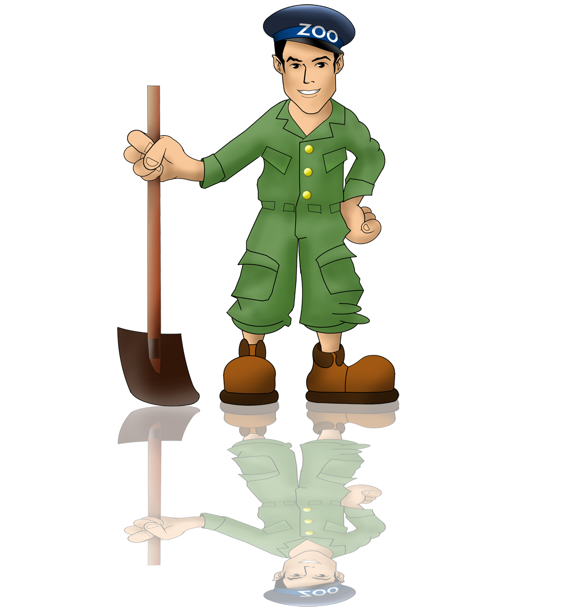

#  | kafka minit cluster | infra #

##    

## What is this folder for? ##

### Quick summary

This project is intended to demosntrate a `Terraform` infrastruture as code for `Apache Kafka`.

## Environments description

There are 2 flavors of environment for this project, one with ZooKeeper and the other with KRaft.

### 1.  Original ZooKeeper environment 

Originally, the environmnent was 1 `ZooKeeper` and 3 `Kafka Brokers` containers. 

[Environment with ZooKeeper description](infra/zookeeper/ENVIRONMENT.md)

### 2.  KRaft environment 

With kafka introduction of KRaft to replace ZooKeeper, a new enviroment was created with 3 `Kafka Brokers` containers. 

[Environment with KRaft description](infra/kraft/ENVIRONMENT.md)

## How do I get set up? ##

### 1. Summary of set up

All environments are built using Terraform.  

Basically it's necessary to initialize the Terraform environment.  

- build
- execution

### 2. build

The build part trigger the construction of objects that consume a lot of time, like the `docker images`.  
It also creates objects that are desired to persist between executions, like `docker volumes`.

#### 2.1.  ZooKeeper

[ZooKeeper build instructions](infra/zookeeper/terraform/build/BUILD.md)

#### 2.2.  KRaft

[KRaft build instructions](infra/kraft/terraform/build/BUILD.md)

### 3. execution

It's intended to be very fast, less than 1 min.   
Here are created and `docker containers` and `docker networks` and destroyed after use.  

#### 3.1.  ZooKeeper

[ZooKeper execution instructions](infra/zookeeper/terraform/exec/EXEC.md)

#### 3.2.  KRaft

[KRraft execution instructions](infra/kraft/terraform/exec/EXEC.md)

### 4. Dependencies

- [install docker](https://docs.docker.com/get-docker/) 
- [install terraform](https://learn.hashicorp.com/tutorials/terraform/install-cli) 

## Who do I talk to? ##

### Repo owner 

alex.carvalho.data@gmail.com